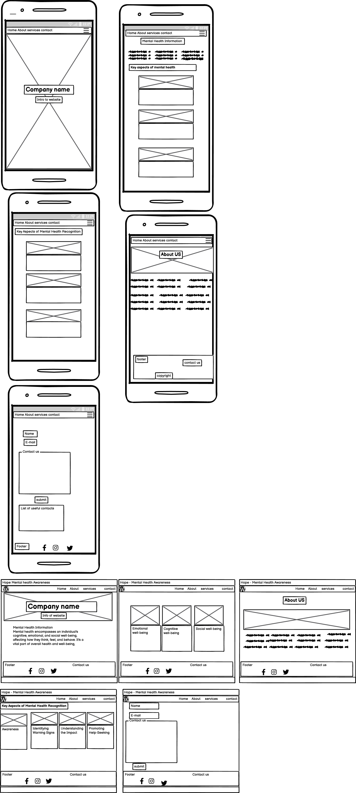
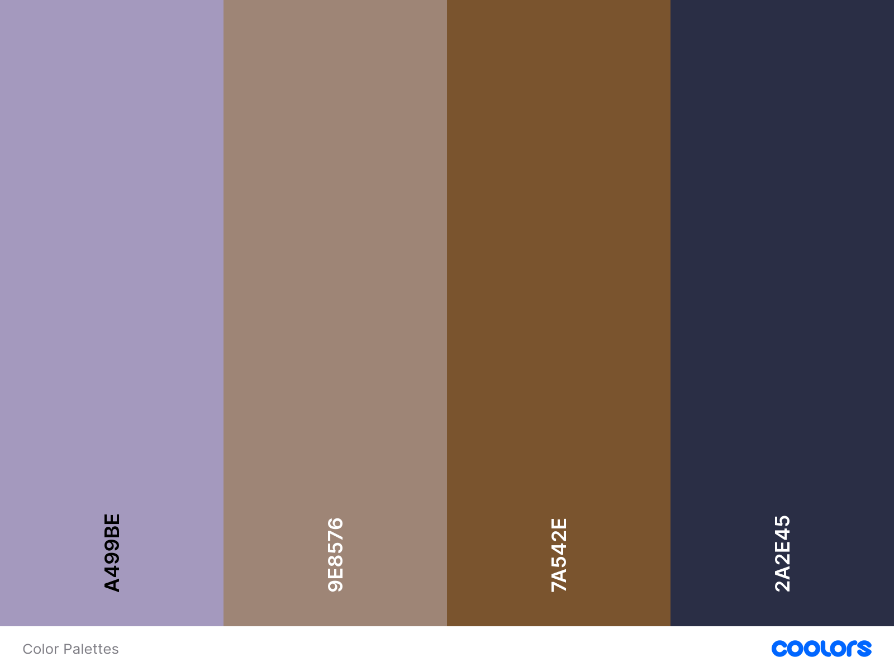

# Portfolio Project 1 - Mental Health Awareness Website

This website has been created to fulfill the project brief for Code Institute's first individual assessment.

The live link can be found here: [Hope - Mental Health Awareness](https://bytenadeem.github.io/hope-project-1/)

# Description
Hope-Mental Health Awareness is a fully responsive static HTML and CSS website designed to inform those seeking help and support about Mental Health issues and how to recognise symptoms. 

# Wireframes

# How AI Was Used

Artificial Intelligence played a significant role in the development of this project. Here are some ways AI was utilized:

- Code Generation

     - AI tools like GitHub Copilot were used to generate code snippets for various parts of the     website. This included HTML structure and CSS styling. The AI provided context-aware suggestions  that helped streamline the coding process and reduce development time.

- Debugging

    - AI-powered debugging tools were utilized to identify and fix issues in the code. These tools analyzed the codebase, detected potential bugs, and provided recommendations for resolving them. This ensured a smoother development process and a more robust final product.

- Image Generation

    - DALL-E, Microsoft Designe, an AI model developed by OpenAI, was used to generate the images for the website. Squoosh was used to resize the images. 

- Content Assistance

    - AI tools like GitHub Copilot were used to assist in writing code and content for the website. These tools provided suggestions and auto-completions, which sped up the development process and ensured high-quality code.

- Accessibility Improvements

  - AI was used to analyze the website's accessibility features. Tools like Lighthouse provided insights into how accessible the website is for users with disabilities and suggested improvements to enhance user experience.

By utilising AI, the project was able to achieve a higher level of efficiency, creativity, and accessibility.

# Features

The website includes several features, which are detailed below.

- Colour Palette
        - The website uses beaver colour in navbar and footer as a primary colour. These colors are complemented by white to ensure readability and a clean look. The color palette is applied consistently across all elements of the website, including backgrounds, text, buttons, and links, to maintain a unified aesthetic.

